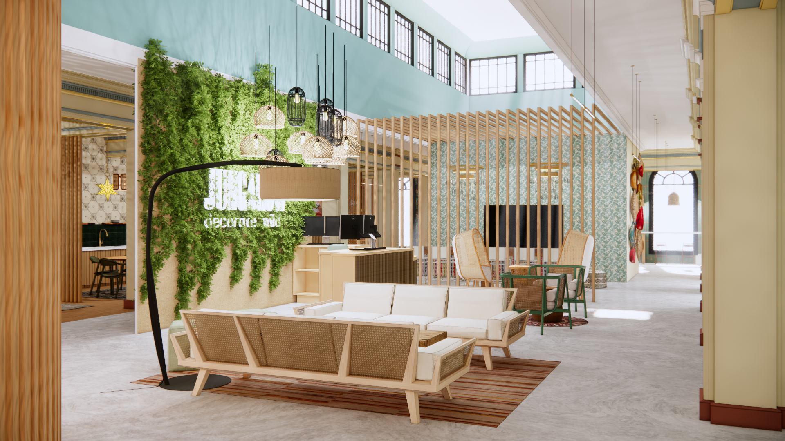
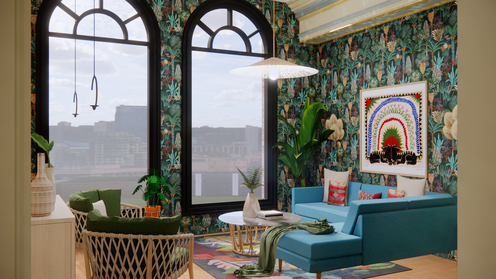
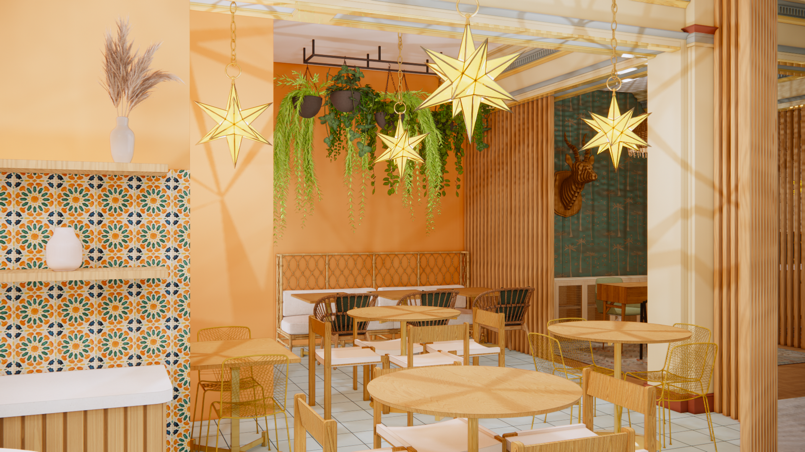
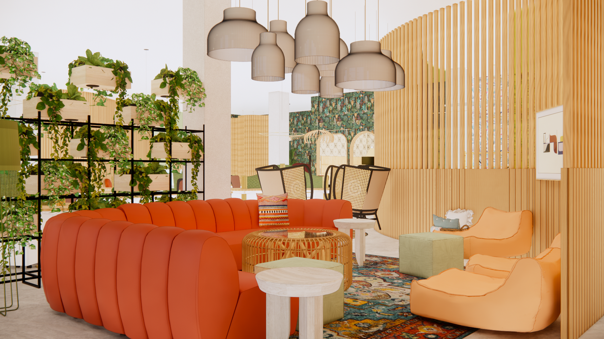
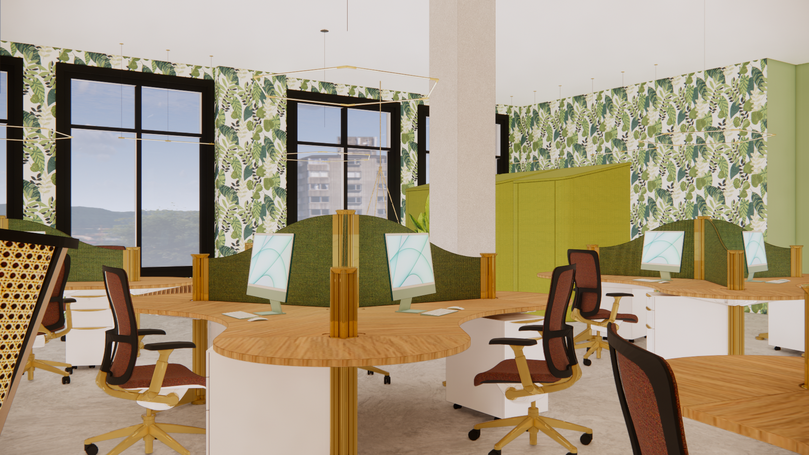
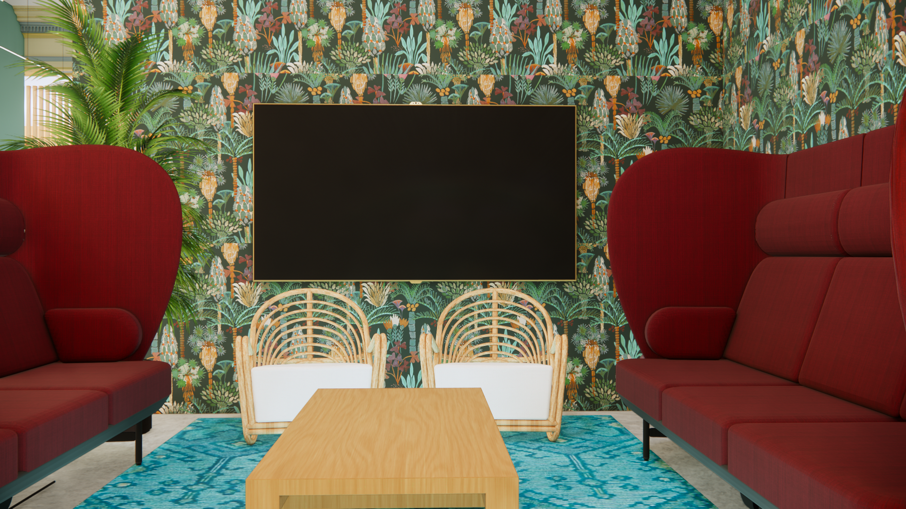

# Marlo Rendering Portfolio

## Description

This is a quick project for Marlo Pochiro. Marlo is an Interior Design Student at The College For Creative Studies. This project is meant to act as a easy and intutive portfolio website to house images of her design renderings.

I was inspired by [Camile Mormal's](https://camillemormal.com/) smooth animation transitions and tried to replicate the effects and explain how they work.

## Table of Contents

- [Installation](#installation)
- [Usage](#usage)
- [Credits](#credits)

## Images

These are the images used for the site.








## Usage

Depending on hosting and domain acqusition, may be hosted at [Link](#) or [Github Site](#)

### Local Installation

- Create a folder on your device 

        ``` mkdir '__Name__' ``` 

- Clone this repository

        ``` git clone https://github.com/Jack41400/marlo-renderings.git ```

- Run ``` index.html ``` locally

## Credits

Image credits to **Marlo Pochiro** rendered in *Enscape*.

Site design inspiration to **Camille Mormal** & **Hyperplex**

