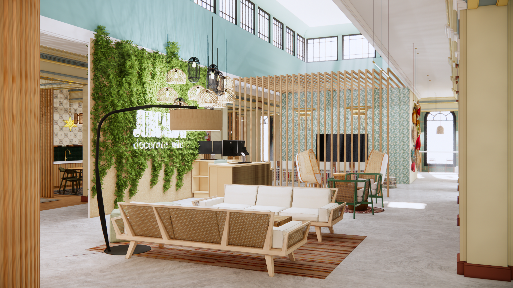
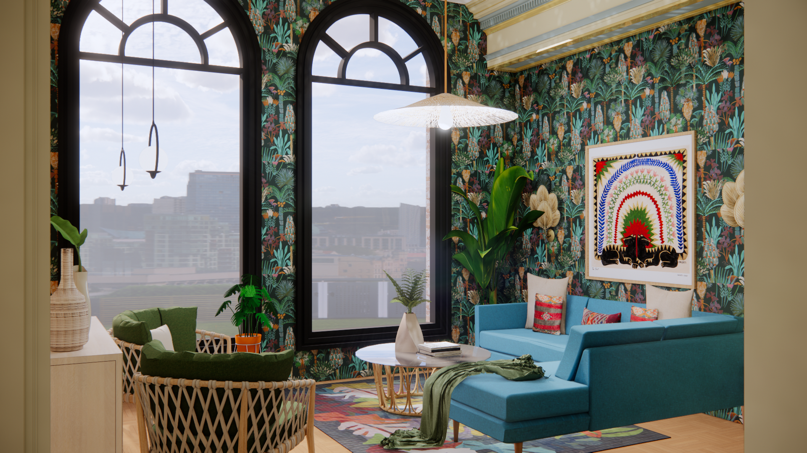
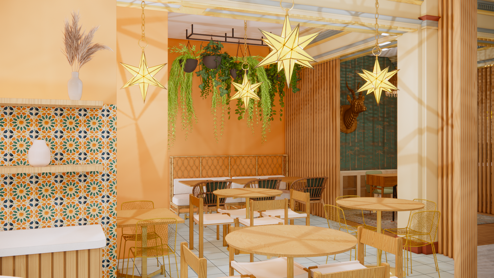
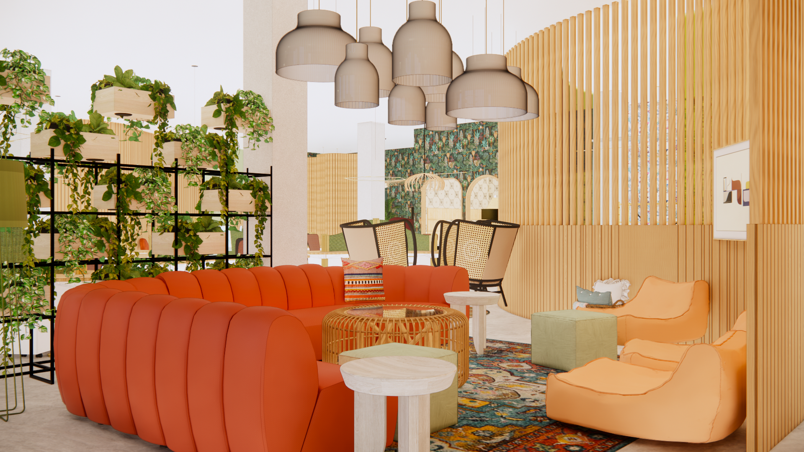

# Marlo Rendering Portfolio

## Description

This is a quick project for Marlo Pochiro. Marlo is an Interior Design Student at The College For Creative Studies. This project is meant to act as a easy and intutive portfolio website to house images of her design renderings.

I was inspired by (website/youtube video)'s smooth animation transitions and tried to replicate the effects and explain how they work.

## Table of Contents

- [Installation](#installation)
- [Usage](#usage)
- [Credits](#credits)

## Images

